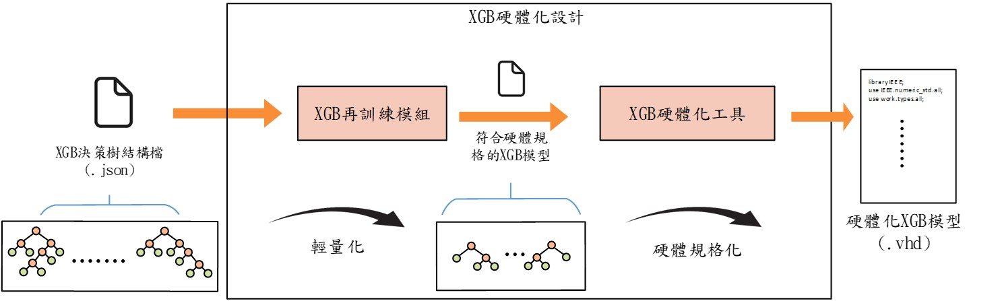
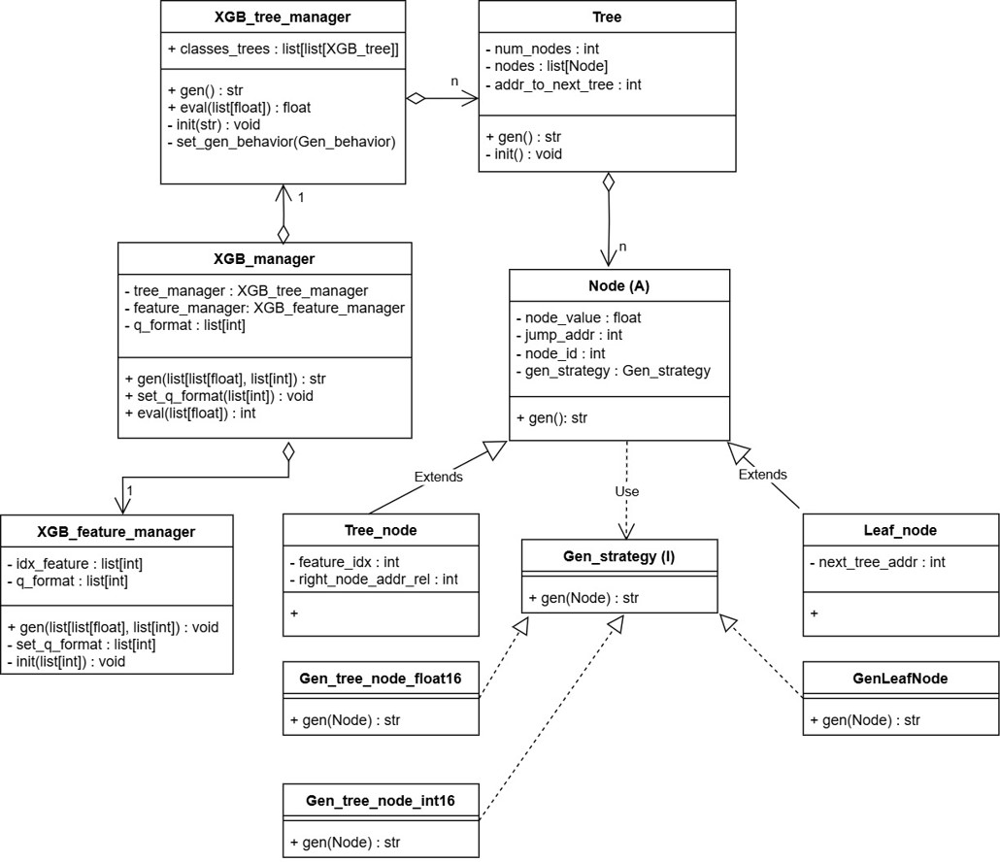
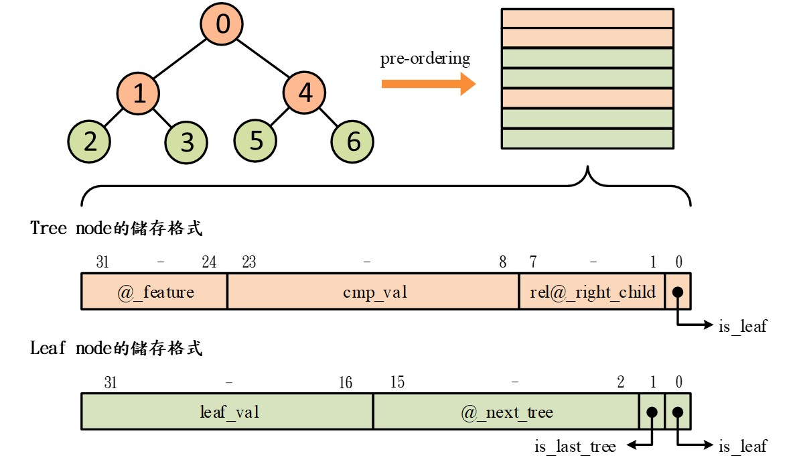

# XGBoost硬體化工具
本工具透過管理一系列封裝好的類別(class)，能夠自動化的將訓練出來的XGBoost模型中的多決策樹結構轉換可以在FPGA上運行的結構

# Usage
1. 將訓練好的模型使用XGBoost官方提供的功能儲存為.json的決策樹結構，模型中決策樹的大小＇節點數量＇單子樹的深度都應該要確保不會超出硬體化中資料位元的儲存上限
2. 打開任意python程式，import本工具，呼叫XGB_manager的建構子並將XGBoost模型的檔案路徑作為傳入參數建立物件
3. 建立好的物件可以使用能夠set_gen_behavior與set_q_format更改節點在硬體中儲存各個資訊的佔用位元與Q-format的形式
4. 使用__生成VHDL code，將生成的程式碼與另一個開源項目的資源結合，最後使用EDA tool就可以直接進行硬體的驗證與燒錄了

# description
本專案在設計時考慮到Node class在原生與硬體化轉換的變動可能最為頻繁，因此使用了strategy design patten將硬體化規格的實作向外推至其他類別來實作
## UML diagram

本專案主要參考另一個開源項目所定義好的多決策樹的硬體加速器電路IP，該專案規定了決策樹的格式，將一單node所帶的資訊限縮至32bit中，也因此本專案所產生的決策樹結構也需要固定儲存空間的大小至一個word中，但加入了可以更動佔用位元的功能
## node的硬體化規格

# reference
### FPGA Accelerator for Gradient Boosting Decision Trees
paper link : https://www.mdpi.com/2079-9292/10/3/314  \n
github link : https://github.com/universidad-zaragoza/FPGA_accelerator_for_GBDT
